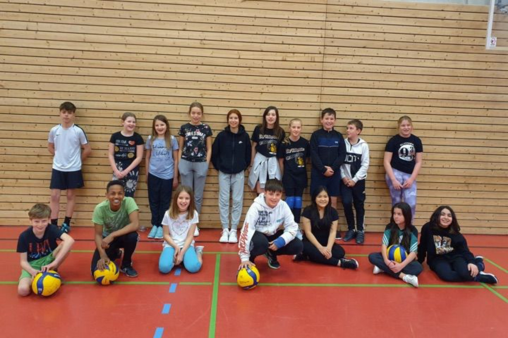

<main class="flex-grow-1">
  <section id="page-simple" class="section-bg {{ page.title | strip | remove: ' ' }}">
    

      

        

          

            <h1>Sei dabei!</h1>
            
Der Volleyball Club Müllheim veranstaltet dieses Jahr ein internationales Jugendturnier und du bist herzlich eingeladen!

            

              

              

            

          

        

        

          

            <h3>Wann geht es los?</h3>
            Am {{ page.datum }} um {{ page.beginn }} startet das Turnier. Ab {{ page.oeffnung }} ist die Halle geöffnet.
            <h3>Wo ist das Turnier?</h3>
            Das Turnier findet in der {{ page.ort }} statt. Der Eingang befindet sich in einer Gasse der Bismarckstraße gegenüber des Hebel Park.
            <h3>Wie wird gespielt?</h3>
            Das Turnier wird männlich/weiblich wie folgt aufgeteilt:
            <ul>
              <li>Jahrgang 2008 spielen 4:4</li>
              <li>Jahrgang 2009 spielen 3:3</li>
              <li>Jahrgang 2010 und jünger spielen 2:2</li>
            </ul>
            <h3>Welche Kosten entstehen?</h3>
            Wir erheben keine Anmeldegebühr. Spenden werden jedoch gerne angenommen.
            <h3>Was muss ich mitbringen?</h3>
            Alle Teilnehmer:innen <u>müssen</u> Hallenschuhe tragen! 
            Wir bitten darum, Essen & Trinken selbst mitzubringen und Abfälle auch selbst wieder mitzunehmen.
            <h3>Wie kann ich uns anmelden?</h3>
            Der Anmeldeschluss ist Mittwoch der <b>06.07.2022</b>. Für die Anmeldung nutze bitte folgendes Formular:
            <a href="https://forms.gle/rE8eJRyrBKXifYEfA" target="_blank">https://forms.gle/rE8eJRyrBKXifYEfA</a>
          

        

        

          

            <h3 class="pb-2 d-none d-lg-block">Karte</h3>
            

              <iframe
                src="https://www.google.com/maps/embed?pb=!1m18!1m12!1m3!1d981.2971432726546!2d7.625133238726226!3d47.81179536235966!2m3!1f0!2f0!3f0!3m2!1i1024!2i768!4f13.1!3m3!1m2!1s0x4791a76a266450d9%3A0xf41bcf4e53026d4e!2sSporthalle%20II!5e0!3m2!1sen!2sde!4v1655294109092!5m2!1sen!2sde"
                width="100%"
                height="100%"
                style="border: 0"
                allowfullscreen=""
                loading="lazy"
                referrerpolicy="no-referrer-when-downgrade"
              ></iframe>
            

          

        

        

          

            

              <h3>Ansprechperson</h3>
              Klaus-Dieter Ernst 
              <a href="mailto:klaus@vcmuellheim.de"><i class="fa-solid fa-envelope" aria-hidden="true"></i> klaus@vcmuellheim.de</a>
            

            

              
            

          

        

      

    

  </section>
</main>
